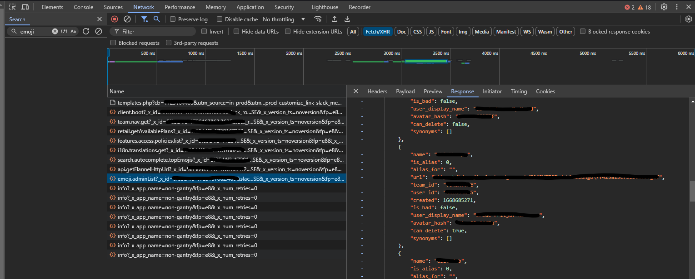
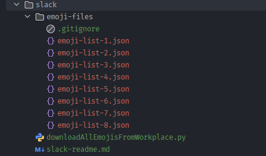

# Slack Readme

## How to use the script

### Step 1

In your **browser**, go to `Custimise your workspace` and open developer tools, and go to `Network`.
Look for `emoji.adminList?` and copy the response in to a file, and place the file in `emoji-files`


### Step 2

Slack is using pagination so you have to redo step 1 if you have more than 100 custom emojis. It will also say on the
bottom of all responses from `emoji.adminList?` how many pages you have left

````json
...,
"disabled_emoji": [],
"custom_emoji_total_count": 769,
"paging": {
"count": 100,
"total": 769,
"page": 1,
"pages": 8
}
````

To get the other pages, simply scroll down on the emoji-list and more requests called `emoji.adminList` will appear.
Your folder should look something like the following when you are done. (`.gitignore` will be ignored by the python
script)



### Step 3

Run the script, and your emojis should be in a folder called `./emojis`
